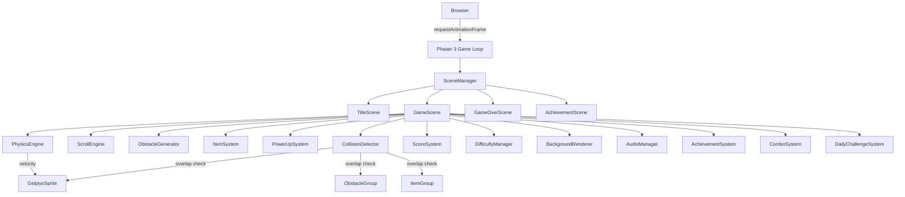
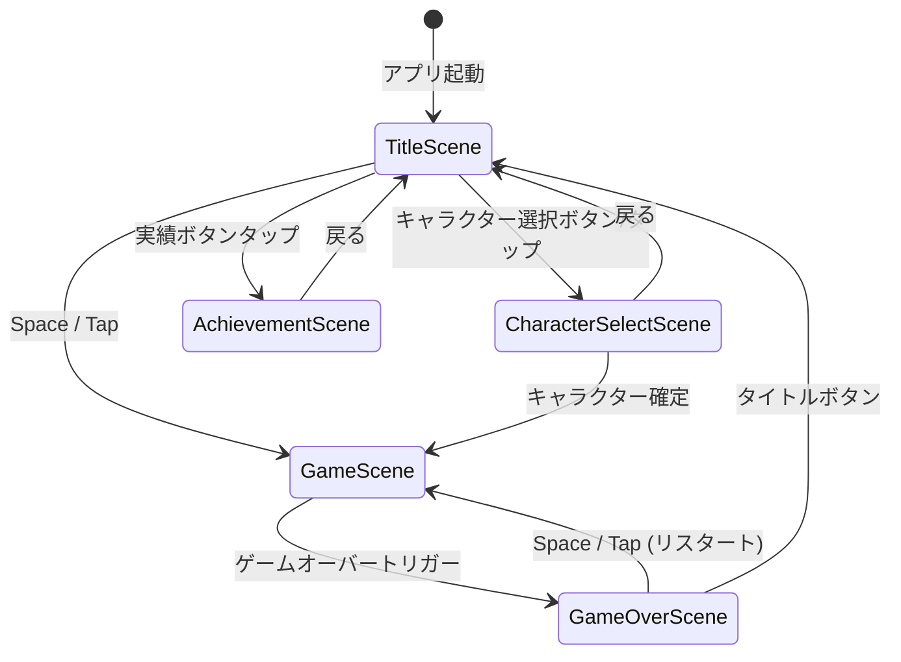

# Design Document: ゲルぴよ深海大冒険

## Overview

「ゲルぴよ深海大冒険」は、HTML5 Canvas と TypeScript で構築するブラウザ実行型の横スクロールワンタップアクションゲームである。Flappy Bird スタイルの物理挙動をベースに、深海世界観のビジュアル・5 段階エリア構成・コンボ/アイテム/実績システムを組み合わせることで、子供から大人まで楽しめるリプレイ性の高いゲームを実現する。

### 技術選定

| 関心事 | 選択 | 理由 |
|---|---|---|
| ゲームフレームワーク | **Phaser 3** | Scene 管理・物理・カメラ・入力・オーディオを統合済み。Canvas/WebGL 自動選択。スマートフォン対応の実績あり |
| 言語 | **TypeScript** | 型安全性によるバグ削減、大規模オブジェクトモデルの可読性向上 |
| ビルドツール | **Vite** | 高速 HMR、TypeScript ネイティブサポート、静的ビルド |
| 物理 | **カスタム実装 (Phaser Arcade Physics ベース)** | シンプルな Y 軸移動のみ。Arcade Physics で十分、MatterJS は過剰 |
| 音声 | **Web Audio API (Phaser Sound Manager 経由)** | クロスブラウザ対応、フェードクロスフェード機能付き |
| 保存 | **localStorage** | セッション跨ぎのハイスコア・実績保存 |
| テスト | **Vitest + fast-check** | Vite 環境との親和性、プロパティベーステストライブラリ |

---

## Architecture

### ゲームループ概要

Phaser 3 の `Game` インスタンスが 60fps の `requestAnimationFrame` ループを駆動する。各フレームで `update()` → `render()` が呼ばれ、シーン単位でロジックが分離される。



### シーン遷移



### モジュール構成（ファイルツリー）

```
src/
├── main.ts                      # Phaser.Game インスタンス生成、Vite エントリポイント
├── config.ts                    # ゲーム設定定数（画面サイズ、物理パラメータ等）
├── scenes/
│   ├── TitleScene.ts
│   ├── CharacterSelectScene.ts
│   ├── GameScene.ts
│   ├── GameOverScene.ts
│   └── AchievementScene.ts
├── systems/
│   ├── PhysicsEngine.ts
│   ├── ScrollEngine.ts
│   ├── ObstacleGenerator.ts
│   ├── CollisionDetector.ts
│   ├── ScoreSystem.ts
│   ├── ItemSystem.ts
│   ├── PowerUpSystem.ts
│   ├── AudioManager.ts
│   ├── BackgroundRenderer.ts
│   ├── DifficultyManager.ts
│   ├── AchievementSystem.ts
│   ├── ComboSystem.ts
│   └── DailyChallengeSystem.ts
├── models/
│   ├── GameState.ts
│   ├── Player.ts
│   ├── Obstacle.ts
│   ├── Item.ts
│   ├── PowerUp.ts
│   ├── Achievement.ts
│   ├── DailyChallenge.ts
│   └── Character.ts
├── utils/
│   ├── StorageManager.ts        # localStorage 読み書き
│   ├── MathUtils.ts             # 衝突判定、補間関数
│   └── ParticleFactory.ts       # パーティクル生成ヘルパー
├── assets/
│   ├── sprites/
│   ├── audio/
│   └── fonts/
└── tests/
    ├── physics.test.ts
    ├── scoring.test.ts
    ├── difficulty.test.ts
    ├── collision.test.ts
    ├── combo.test.ts
    ├── storage.test.ts
    └── character.test.ts
```

---

## Components and Interfaces

### PhysicsEngine

Gelpiyo の垂直運動を管理する。重力加速度ではなく「浮力喪失」として下向き一定加速を適用し、タップ/スペースで上向きインパルスを付与する。

```typescript
interface PhysicsEngineConfig {
  gravity: number;          // px/s² (下向き正、初期値: 800)
  jumpImpulse: number;      // px/s  (上向き正、初期値: -400)
  maxFallSpeed: number;     // px/s  (初期値: 600)
  maxRiseSpeed: number;     // px/s  (初期値: -500)
  boundsTop: number;        // px
  boundsBottom: number;     // px
}

class PhysicsEngine {
  private config: PhysicsEngineConfig;

  loadCharacterPhysics(character: CharacterConfig): void;  // キャラクター変更時に呼ぶ
  update(player: Player, delta: number): void;
  applyJump(player: Player): void;
  clampToBounds(player: Player): void;
  isAtTopBound(player: Player): boolean;
  isAtBottomBound(player: Player): boolean;
}
```

**アルゴリズム（Euler 積分）**:
```
velocity_y += gravity * delta
velocity_y = clamp(velocity_y, maxRiseSpeed, maxFallSpeed)
position_y += velocity_y * delta
position_y = clamp(position_y, boundsTop, boundsBottom)
```

---

### ScrollEngine

ゲームワールドの横スクロール速度を管理する。

```typescript
interface ScrollEngineConfig {
  initialSpeed: number;   // px/s (初期値: 200)
  maxSpeedMultiplier: number; // 3.0 (Req 4.5)
}

class ScrollEngine {
  currentSpeed: number;
  setSpeed(speed: number): void;
  applySpeedMultiplier(multiplier: number): void;  // パワーアップ用
  restoreSpeed(): void;
  update(delta: number): void;
  readonly maxSpeed: number;
}
```

---

### ObstacleGenerator

障害物の生成・スポーン・寿命管理を行う。

```typescript
type ObstacleType = 'cave_wall' | 'jellyfish' | 'squid' | 'seaweed' | 'current_zone';

interface ObstacleSpawnConfig {
  type: ObstacleType;
  x: number;
  y: number;
  gapSize?: number;          // cave_wall 用
  amplitude?: number;        // jellyfish / seaweed 用
  frequency?: number;        // jellyfish / seaweed 用
  pushForce?: number;        // current_zone 用
}

class ObstacleGenerator {
  spawnObstacle(config: ObstacleSpawnConfig): Obstacle;
  update(delta: number): void;
  removeOffscreen(): void;
  getActiveObstacles(): Obstacle[];
  setSpawnInterval(ms: number): void;
}
```

**障害物の動作**:

| タイプ | 移動パターン |
|---|---|
| cave_wall | 画面左へ一定速度 |
| jellyfish | 左移動 + `y += A * sin(ωt)` |
| squid | 右から左への水平移動（速度: スクロール速度 × 1.5） |
| seaweed | 固定 X（スクロールに乗る）+ `rotation = B * sin(ωt)` |
| current_zone | 半透明ゾーン。内部に居る間 `push_x` を Gelpiyo へ加算 |

---

### CollisionDetector

```typescript
class CollisionDetector {
  checkObstacleCollision(player: Player, obstacles: Obstacle[]): Obstacle | null;
  checkItemCollision(player: Player, items: Item[]): Item | null;
  checkBoundaryCollision(player: Player, bounds: GameBounds): BoundaryHit | null;
}

type BoundaryHit = 'top' | 'bottom';
```

**衝突判定アルゴリズム（AABB + 円形ヒットボックスのハイブリッド）**:

Gelpiyo は半径 `r` の円ヒットボックスを持つ（視覚サイズより 20% 小さく設定しフェアな判定を実現）。  
障害物は AABB（軸平行バウンディングボックス）。  
円-矩形衝突は以下で判定:

```
dx = clamp(circle.cx, rect.left, rect.right) - circle.cx
dy = clamp(circle.cy, rect.top, rect.bottom) - circle.cy
collides = (dx*dx + dy*dy) <= circle.r * circle.r
```

---

### ScoreSystem

```typescript
class ScoreSystem {
  currentScore: number;
  highScore: number;

  initialize(): void;                          // localStorage から highScore 読み込み
  incrementScore(points: number): void;
  applyComboMultiplier(multiplier: number, basePoints: number): number;
  checkAndUpdateHighScore(): boolean;          // true = new record
  persistHighScore(): void;
  reset(): void;
}
```

---

### DifficultyManager

```typescript
interface DifficultyState {
  elapsedTime: number;       // ms
  scrollSpeed: number;       // px/s
  spawnInterval: number;     // ms
  gapSize: number;           // px
  currentArea: AreaTheme;
}

type AreaTheme = 'shallow_reef' | 'cave' | 'sunken_ship' | 'deep_ruins' | 'ultra_deep';

class DifficultyManager {
  state: DifficultyState;

  update(delta: number): void;
  getCurrentArea(): AreaTheme;
  getAreaThresholds(): Record<AreaTheme, number>;  // score → AreaTheme mapping
  reset(): void;
}
```

**難易度調整スケジュール**:

| トリガー | 変化量 |
|---|---|
| 10 秒ごと | スクロール速度 += 初期速度 × 0.05 (上限: 初期 × 3) |
| 15 秒ごと | スポーン間隔 -= 10% (下限: 初期 × 0.4) |
| 20 秒ごと | ギャップ幅 -= 10px (下限: 150px) |

**エリア閾値（スコアベース）**:

| エリア | スコア閾値 |
|---|---|
| shallow_reef | 0 |
| cave | 15 |
| sunken_ship | 30 |
| deep_ruins | 50 |
| ultra_deep | 75 |

---

### ItemSystem

```typescript
type ItemType = 'pearl' | 'crystal' | 'treasure' | 'bubble';

interface ItemConfig {
  type: ItemType;
  points: number;
  spawnWeight: number;   // 相対スポーン確率
}

const ITEM_CONFIGS: Record<ItemType, ItemConfig> = {
  pearl:    { type: 'pearl',    points: 5,  spawnWeight: 50 },
  crystal:  { type: 'crystal',  points: 10, spawnWeight: 30 },
  treasure: { type: 'treasure', points: 20, spawnWeight: 15 },
  bubble:   { type: 'bubble',   points: 0,  spawnWeight: 5  },
};

class ItemSystem {
  spawnItem(x: number, y: number): Item;
  collectItem(item: Item, player: Player): CollectionResult;
  hasBubbleShield(player: Player): boolean;
  consumeBubbleShield(player: Player): void;
}
```

---

### PowerUpSystem

```typescript
type PowerUpType = 'bubble_shield' | 'slow_motion' | 'magnet';

interface ActivePowerUp {
  type: PowerUpType;
  remainingDuration: number;  // ms
  startedAt: number;
}

class PowerUpSystem {
  activePowerUps: ActivePowerUp[];

  activate(type: PowerUpType): void;
  update(delta: number): void;
  isActive(type: PowerUpType): boolean;
  deactivate(type: PowerUpType): void;
  getRemainingDuration(type: PowerUpType): number;  // ms
}
```

---

### BackgroundRenderer

```typescript
interface ParallaxLayer {
  sprites: Phaser.GameObjects.TileSprite[];
  scrollFactor: number;   // 0.0～1.0（far: 0.2, mid: 0.5, near: 0.8）
  theme: AreaTheme;
}

class BackgroundRenderer {
  layers: ParallaxLayer[];
  particles: Phaser.GameObjects.Particles.ParticleEmitter;

  update(delta: number): void;
  transitionToTheme(theme: AreaTheme, duration: number): void;
  private updateParticles(): void;
}
```

---

### AudioManager

```typescript
type SoundKey =
  | 'bgm_shallow' | 'bgm_cave' | 'bgm_sunken' | 'bgm_ruins' | 'bgm_ultra'
  | 'sfx_swim' | 'sfx_score' | 'sfx_item' | 'sfx_gameover' | 'sfx_achievement' | 'sfx_powerup';

class AudioManager {
  muted: boolean;

  playBGM(key: SoundKey): void;
  crossfadeBGM(toKey: SoundKey, duration: number): void;  // Req 13.6 (2秒)
  playSFX(key: SoundKey): void;
  toggleMute(): void;
  stopAll(): void;
}
```

---

### AchievementSystem

```typescript
interface Achievement {
  id: string;
  title: string;
  description: string;
  condition: AchievementCondition;
  unlocked: boolean;
  unlockedAt?: number;      // timestamp
}

type AchievementCondition =
  | { type: 'score'; threshold: number }
  | { type: 'items_collected'; count: number }
  | { type: 'survive_seconds'; seconds: number }
  | { type: 'combo'; count: number }
  | { type: 'area_reached'; area: AreaTheme };

class AchievementSystem {
  achievements: Achievement[];

  check(event: GameEvent): Achievement[];    // 条件を満たした実績リストを返す
  unlock(id: string): void;
  persist(): void;
  load(): void;
  getAll(): Achievement[];
}
```

---

### ComboSystem

```typescript
class ComboSystem {
  count: number;
  multiplier: number;         // 1x / 2x / 3x

  onItemCollected(): void;    // カウント増加
  onObstaclePassed(): void;   // コンボリセット (Req 17.5: アイテムを取らずに通過)
  getMultiplier(): number;    // count < 3 → 1, count < 5 → 2, else → 3
  reset(): void;
}
```

---

### DailyChallengeSystem

```typescript
interface DailyChallenge {
  date: string;                // "YYYY-MM-DD"
  type: 'score' | 'items' | 'survive';
  objective: number;
  bonusScore: number;
  completed: boolean;
  progress: number;
}

class DailyChallengeSystem {
  current: DailyChallenge;

  generateForToday(): DailyChallenge;
  updateProgress(event: GameEvent): void;
  complete(): void;
  load(): void;
  persist(): void;
  isNewDay(): boolean;
}
```

---

### CharacterSelectScene

キャラクター選択 UI を管理する Phaser シーン。選択内容は localStorage に永続化される。

```typescript
class CharacterSelectScene extends Phaser.Scene {
  private selectedCharacter: CharacterType;
  private characterCards: CharacterCard[];

  preload(): void;      // キャラクタースプライト・背景のロード
  create(): void;       // カードUI生成、ストレージからの選択復元
  update(): void;       // プレビューアニメーション更新

  private onCardSelected(type: CharacterType): void;
  private onConfirm(): void;              // → GameScene へ遷移
  private onBack(): void;                 // → TitleScene へ遷移
  private renderPreviewAnimation(): void; // 選択中キャラのアニメ表示
}
```

**シーン起動フロー**:
1. `create()` で localStorage から前回選択キャラを読み込み（未保存時は `'gelpiyo'`）
2. 4 枚のキャラクターカードを横並びに配置。各カードに名前・説明・難易度ラベルを表示
3. カード選択時に `renderPreviewAnimation()` で選択中キャラのアニメーションプレビューを更新
4. 確定ボタン押下で `onConfirm()` → localStorage 保存 → GameScene へ遷移
5. 戻るボタン押下で `onBack()` → TitleScene へ遷移

---

## Data Models

### CharacterType / CharacterConfig / CharacterPhysics

```typescript
type CharacterType = 'gelpiyo' | 'momopliyo' | 'palpiyo' | 'midoripiyo';

interface CharacterConfig {
  id: CharacterType;
  nameJa: string;            // 表示名（日本語）
  description: string;       // キャラクター説明
  difficultyLabel: string;   // 難易度表示（例: "バランス型", "俊敏", "遅い"）
  color: string;             // 代表カラー (hex)
  physics: CharacterPhysics;
}

interface CharacterPhysics {
  jumpImpulse: number;       // px/s (上向き負)
  gravity: number;           // px/s²
  maxFallSpeed: number;      // px/s
  maxRiseSpeed: number;      // px/s
}

const CHARACTER_CONFIGS: Record<CharacterType, CharacterConfig> = {
  gelpiyo:    { id: 'gelpiyo',    nameJa: 'ゲルぴよ',   description: 'バランスの取れたノーマルキャラ', difficultyLabel: 'バランス型', color: '#7EC8E3', physics: { jumpImpulse: -400, gravity: 800, maxFallSpeed: 600, maxRiseSpeed: -500 } },
  momopliyo:  { id: 'momopliyo',  nameJa: 'ももぴよ',   description: 'ふんわり跳ねる愛らしいキャラ',   difficultyLabel: '中級',      color: '#FFB7C5', physics: { jumpImpulse: -450, gravity: 850, maxFallSpeed: 650, maxRiseSpeed: -550 } },
  palpiyo:    { id: 'palpiyo',    nameJa: 'パルぴよ',   description: '俊敏で素早い上級者向けキャラ',   difficultyLabel: '上級・俊敏', color: '#A0D8EF', physics: { jumpImpulse: -500, gravity: 900, maxFallSpeed: 700, maxRiseSpeed: -600 } },
  midoripiyo: { id: 'midoripiyo', nameJa: 'みどりぴよ', description: '細かい操作ができるゆっくりキャラ', difficultyLabel: '細かい操作', color: '#B5EAD7', physics: { jumpImpulse: -320, gravity: 650, maxFallSpeed: 500, maxRiseSpeed: -400 } },
};
```

---

### GameState

```typescript
interface GameState {
  screen: 'title' | 'game' | 'gameover' | 'achievement';
  score: number;
  highScore: number;
  elapsedTime: number;           // ms
  currentArea: AreaTheme;
  isGameOver: boolean;
  isNewRecord: boolean;
}
```

### Player

```typescript
interface Player {
  x: number;
  y: number;
  velocityY: number;
  radius: number;               // ヒットボックス半径
  hasBubbleShield: boolean;
  animationState: 'swim_up' | 'fall_down' | 'idle' | 'hit';
}
```

### Obstacle

```typescript
interface Obstacle {
  id: string;
  type: ObstacleType;
  x: number;
  y: number;
  width: number;
  height: number;
  gapY?: number;                // cave_wall 用: ギャップ中央 Y
  gapSize?: number;             // cave_wall 用: ギャップ幅 px
  phase?: number;               // jellyfish/seaweed 用: sin の位相
  amplitude?: number;
  frequency?: number;
  pushForce?: number;           // current_zone 用
  scored: boolean;              // 通過時のスコア付与済みフラグ
}
```

### Item

```typescript
interface Item {
  id: string;
  type: ItemType;
  x: number;
  y: number;
  radius: number;
  collected: boolean;
  points: number;
}
```

### PowerUp

```typescript
interface PowerUp {
  id: string;
  type: PowerUpType;
  x: number;
  y: number;
  radius: number;
  collected: boolean;
}
```

### StorageSchema

```typescript
interface StorageSchema {
  highScore: number;
  selectedCharacter: CharacterType;   // 選択キャラクター（未設定時は 'gelpiyo'）
  achievements: Record<string, { unlocked: boolean; unlockedAt?: number }>;
  dailyChallenge: DailyChallenge;
}
```

---

## Key Algorithms

### 1. パララックススクロール

各レイヤーは `TileSprite` の `tilePositionX` を毎フレーム加算することで無限スクロールを実現する。

```typescript
// far: scrollFactor=0.2, mid: 0.5, near: 0.8
layers.forEach(layer => {
  layer.tilePositionX += scrollSpeed * layer.scrollFactor * delta;
});
```

視差効果により遠景が遅く近景が速く動き、奥行き感を演出する。

### 2. 難易度カーブ

スクロール速度は線形増加ではなくステップ関数で上昇させることで、「急に難しくなった」感を意図的に演出する。

```typescript
function computeScrollSpeed(elapsed: number, initial: number, max: number): number {
  const steps = Math.floor(elapsed / 10_000);   // 10秒ごとにステップ
  const speed = initial + steps * (initial * 0.05);
  return Math.min(speed, max);
}
```

### 3. 障害物スポーンのランダム化

ギャップの Y 位置は一様乱数 + 前回位置からの最大変動量制限（プレイアビリティ確保）で決定する。

```typescript
function nextGapY(prevGapY: number, canvasH: number, gapSize: number): number {
  const margin = gapSize;
  const minY = margin;
  const maxY = canvasH - margin;
  const maxDelta = canvasH * 0.3;   // 前回から最大 30% 変動
  const target = prevGapY + (Math.random() * 2 - 1) * maxDelta;
  return clamp(target, minY, maxY);
}
```

### 4. コンボ乗数計算

```typescript
function getMultiplier(comboCount: number): number {
  if (comboCount >= 5) return 3;
  if (comboCount >= 3) return 2;
  return 1;
}
```

### 5. マグネットアトラクション

マグネットパワーアップ中、アイテムを Gelpiyo 方向へ引き寄せる。

```typescript
function attractItem(item: Item, player: Player, delta: number): void {
  const dx = player.x - item.x;
  const dy = player.y - item.y;
  const dist = Math.sqrt(dx * dx + dy * dy);
  if (dist < 200) {
    const speed = 300;   // px/s
    item.x += (dx / dist) * speed * delta;
    item.y += (dy / dist) * speed * delta;
  }
}
```

### 6. デイリーチャレンジ生成（日付シード疑似乱数）

毎日同じチャレンジが全ユーザーに生成されるよう、日付文字列をシードとして使用する。

```typescript
function seededRandom(seed: string): () => number {
  let h = 0;
  for (let i = 0; i < seed.length; i++) h = Math.imul(31, h) + seed.charCodeAt(i) | 0;
  return () => { h ^= h << 13; h ^= h >> 17; h ^= h << 5; return (h >>> 0) / 0xFFFFFFFF; };
}
```

---

## Error Handling

| シナリオ | 対応方針 |
|---|---|
| localStorage 読み込み失敗 | try/catch でキャッチし、デフォルト値（highScore=0）でゲーム続行 |
| localStorage 書き込み失敗 | サイレント失敗（ユーザーには通知しない）、次回起動時に再試行 |
| Web Audio API 未対応ブラウザ | AudioManager がオプション扱いで初期化失敗時はミュート状態で動作継続 |
| アセット読み込みエラー | Phaser の `LoaderPlugin` エラーハンドラーでプレースホルダー表示 |
| 画面外スポーン | ObstacleGenerator で X 座標がキャンバス幅 + 50px 以内のみスポーン許可 |
| 60fps 未達フレーム | Phaser の delta time ベース更新のため、フレームレート低下時も物理が崩れない |

---


## Correctness Properties

*A property is a characteristic or behavior that should hold true across all valid executions of a system — essentially, a formal statement about what the system should do. Properties serve as the bridge between human-readable specifications and machine-verifiable correctness guarantees.*

---

### Property 1: 重力による下向き加速の単調性

*For any* Player 状態（初期 Y 速度が最大落下速度に達していない場合）、外部入力なしで PhysicsEngine の `update()` を複数回呼び出すと、velocityY は各フレームで単調増加（下向き）しなければならない。

**Validates: Requirements 3.1**

---

### Property 2: 物理境界クランプの不変条件

*For any* 初期位置（範囲外を含む）と任意の Y 速度に対して、PhysicsEngine の `update()` 呼び出し後、Player の Y 座標は常に `[boundsTop, boundsBottom]` の範囲内に収まらなければならない。ジャンプインパルス適用後も同様に境界内に留まらなければならない。

**Validates: Requirements 3.2, 3.3, 3.4**

---

### Property 3: スクロール速度のステップ関数と上限不変条件

*For any* 経過時間 T（任意の非負整数 ms）に対して、`DifficultyManager` が算出するスクロール速度は `initialSpeed + floor(T / 10000) * increment` に等しく、かつ `initialSpeed * 3` を超えてはならない。また、ギャップサイズは 150px を下回ってはならない。

**Validates: Requirements 4.2, 4.4, 4.5**

---

### Property 4: 衝突検出の健全性（重なりは必ず検出する）

*For any* Gelpiyo の位置（円ヒットボックス半径 r）と、その円に重なる AABB 矩形の Obstacle について、`CollisionDetector.checkObstacleCollision()` は必ず non-null を返さなければならない。逆に、円と矩形が接していない場合は null を返さなければならない。

**Validates: Requirements 8.1, 8.2, 8.3**

---

### Property 5: スコア加算の一貫性

*For any* 現在スコア値（非負整数）と加算ポイント値（正整数）に対して、`ScoreSystem.incrementScore(points)` 呼び出し後のスコアは必ず `previousScore + points` に等しくなければならない。

**Validates: Requirements 9.1**

---

### Property 6: ハイスコアの永続化ラウンドトリップ

*For any* 非負整数のハイスコア値（0 を含む）に対して、`ScoreSystem.persistHighScore()` で保存した後に新しい `ScoreSystem` インスタンスを生成して `initialize()` を呼び出すと、`highScore` フィールドは保存前の値と同じでなければならない。

**Validates: Requirements 9.4, 9.5, 1.4, 1.7**

---

### Property 7: ハイスコア更新条件の正確性

*For any* (currentScore, storedHighScore) のペアにおいて、`currentScore > storedHighScore` の場合、`checkAndUpdateHighScore()` は true を返し localStorage の値を currentScore に更新しなければならない。`currentScore <= storedHighScore` の場合は false を返し localStorage の値を変更してはならない。

**Validates: Requirements 8.6, 12.1, 12.2**

---

### Property 8: アイテムポイント値の正確性

*For any* ItemType（pearl・crystal・treasure）について、そのアイテムを収集したときに ScoreSystem に加算されるポイントは、`ITEM_CONFIGS[type].points` で定義された値と正確に一致しなければならない。

**Validates: Requirements 10.1, 10.2, 10.3**

---

### Property 9: バブルシールドの一回性保護

*For any* プレイヤー状態においてバブルシールドが active な場合、最初の障害物衝突はシールドを消費してゲームオーバーを防がなければならない。シールド消費後の 2 回目の衝突は通常のゲームオーバーを発生させなければならない。この性質は任意の衝突順序で保持されなければならない。

**Validates: Requirements 10.5, 10.6**

---

### Property 10: パワーアップの期間後リストア

*For any* パワーアップタイプと任意のゲーム状態に対して、`PowerUpSystem.activate()` を呼び出した後、duration ms が経過して `update()` が呼ばれると、変更されたすべてのパラメータ（スクロール速度など）は必ずアクティベーション前の値に戻らなければならない。

**Validates: Requirements 11.2, 11.5**

---

### Property 11: 複数パワーアップの独立性

*For any* パワーアップタイプの組み合わせに対して、複数のパワーアップを同時にアクティブにした場合、各パワーアップの `isActive()` は独立して true を返し、一方のパワーアップが期限切れになっても他方の残り時間や効果は変化してはならない。

**Validates: Requirements 11.6**

---

### Property 12: コンボ乗数の単調性と正確性

*For any* コンボカウント（非負整数）に対して、`ComboSystem.getMultiplier()` は `count < 3 → 1`、`3 <= count < 5 → 2`、`count >= 5 → 3` を返さなければならない。また、`onObstaclePassed()` を呼び出した直後のコンボカウントは必ず 0 でなければならない（以前のカウントの値に依存せず）。

**Validates: Requirements 17.1, 17.2, 17.3, 17.5**

---

### Property 13: パララックス速度の相対的順序不変条件

*For any* スクロール速度と delta 時間に対して、BackgroundRenderer の各レイヤーが 1 フレームで進む offset 量は `far < mid < near` の順序を満たさなければならない（far.scrollFactor < mid.scrollFactor < near.scrollFactor）。

**Validates: Requirements 6.2, 6.3**

---

### Property 14: ゲームリセットの完全初期化

*For any* ゲーム状態（スコア・難易度パラメータ・コンボ・パワーアップ）に対して、ゲームリセット操作後、スコアは 0、すべての DifficultyManager パラメータは初期値、コンボカウントは 0 でなければならない。

**Validates: Requirements 12.7**

---

### Property 15: デイリーチャレンジ生成の決定論的確定性

*For any* 同一の日付文字列（"YYYY-MM-DD" 形式）に対して、`DailyChallengeSystem.generateForToday()` を何度呼び出しても必ず同一のチャレンジオブジェクト（type・objective・bonusScore）が生成されなければならない。異なる日付文字列からは異なるチャレンジが生成されなければならない。

**Validates: Requirements 18.1**

---

### Property 16: キャラクター別物理パラメータの一致性

*For any* CharacterType に対して、`PhysicsEngine.loadCharacterPhysics(CHARACTER_CONFIGS[type])` を呼び出した後、PhysicsEngine が使用する `jumpImpulse` と `gravity`（および `maxFallSpeed`・`maxRiseSpeed`）は `CHARACTER_CONFIGS[type].physics` の値と正確に一致しなければならない。また、`applyJump()` が Player に付与するインパルス値も同じ `jumpImpulse` でなければならない。

**Validates: Requirements 22.1, 22.2, 22.3, 22.4, 22.5, 22.6, 22.7**

---

### Property 17: キャラクター選択の永続化ラウンドトリップ

*For any* 有効な CharacterType 値に対して、`StorageManager.saveSelectedCharacter(type)` で保存した後に `StorageManager.loadSelectedCharacter()` を呼び出すと、保存前と同じ CharacterType が返らなければならない。

**Validates: Requirements 21.5, 21.6**

---

## Testing Strategy

### 全体方針

このゲームには純粋な状態変換ロジックが多く（物理エンジン・スコアリング・難易度カーブ・コンボ計算）、プロパティベーステストが効果的に適用できる。一方で UI レンダリング・オーディオ・Phaser シーン遷移はプロパティベーステストの対象外とし、例示ベースのテストまたは統合テストを使用する。

### テストフレームワーク

- **Vitest**: Vite プロジェクトとの統合が seamless、TypeScript ネイティブ
- **fast-check**: JavaScript/TypeScript 向けプロパティベーステストライブラリ
- 各プロパティテストは最低 **100 回** のランダム入力で実行する（fast-check デフォルト: 100）

### プロパティベーステスト（PBT）対象

各テストは以下のタグ形式でコメントを付与する:  
`// Feature: gelpiyo-deep-sea-adventure, Property N: <property_text>`

| テストファイル | 対応プロパティ |
|---|---|
| `tests/physics.test.ts` | Property 1, 2 |
| `tests/difficulty.test.ts` | Property 3 |
| `tests/collision.test.ts` | Property 4 |
| `tests/scoring.test.ts` | Property 5, 6, 7, 8 |
| `tests/items.test.ts` | Property 9 |
| `tests/powerup.test.ts` | Property 10, 11 |
| `tests/combo.test.ts` | Property 12 |
| `tests/background.test.ts` | Property 13 |
| `tests/game_reset.test.ts` | Property 14 |
| `tests/daily_challenge.test.ts` | Property 15 |
| `tests/character.test.ts` | Property 16, 17 |

### ユニットテスト（例示ベース）

PBT を補完する具体例テスト:

- ScoreSystem の初期化（スコア = 0 の確認）
- TitleScreen でのハイスコア表示
- ゲームオーバー画面での NEW RECORD! 表示条件
- AudioManager のミュートトグル
- エリアテーマ閾値の境界値テスト（スコア 14 → cave 未遷移、スコア 15 → cave 遷移）
- ObstacleGenerator がオフスクリーン障害物を削除することの確認

### 統合テスト（例示ベース、1-3 例）

- localStorage が完全に動作するブラウザ環境でのハイスコア永続化
- Phaser シーン遷移（TitleScene → GameScene → GameOverScene）
- デバイスオリエンテーション変更時のキャンバスリサイズ（500ms 以内）

### PBT が適用されないケース

以下は PBT の対象外とし、例示ベースまたはスナップショットテストを使用する:

- **Phaser レンダリング**: Canvas 描画は視覚的テストが困難。スナップショット比較は CI 環境依存
- **AudioManager の BGM 再生**: Web Audio API はブラウザ環境依存
- **アニメーション状態**: Gelpiyo のスプライトアニメーションはビジュアル回帰テストで対応
- **パーティクルエフェクト**: ランダム性が強く期待値の定義が困難
